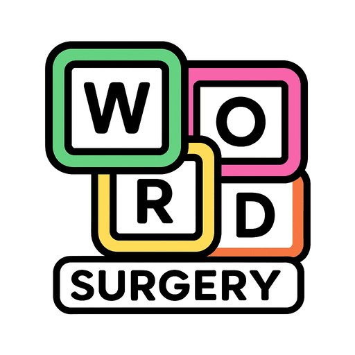
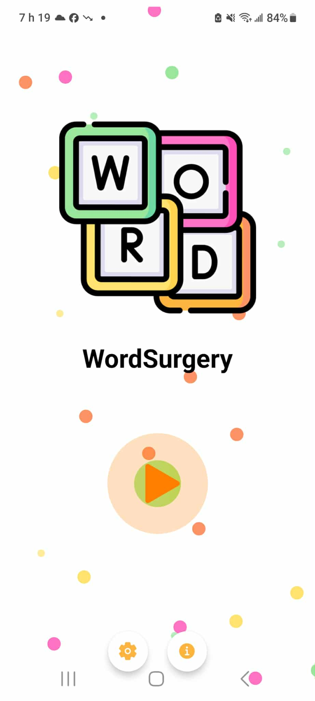
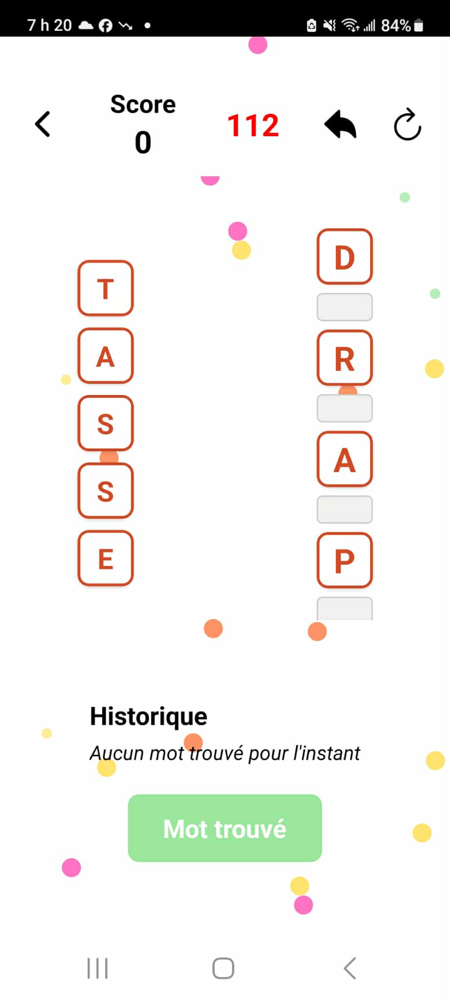
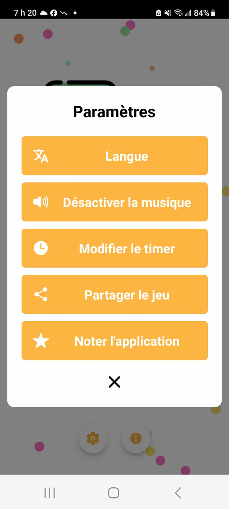
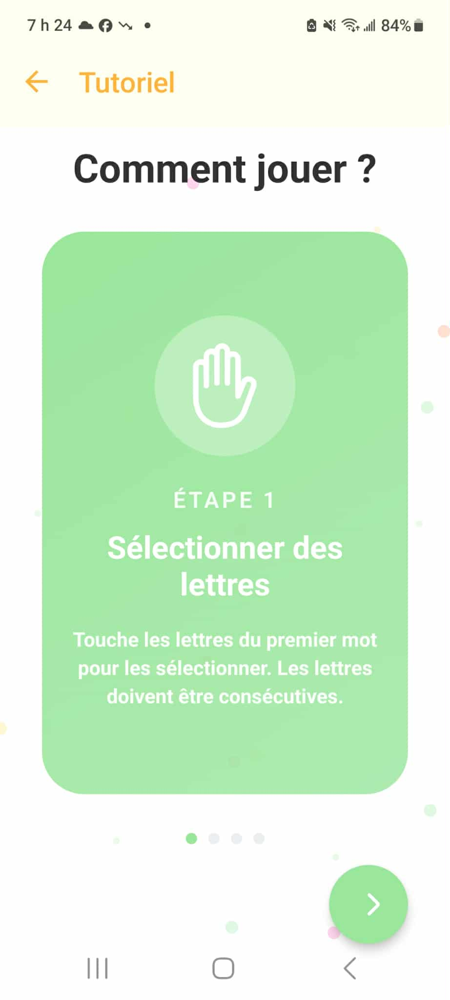

   
#  WordSurgery

An innovative multilingual word puzzle game built with React Native and Expo.

Available on Google Play Store: [Download the app](https://play.google.com/store/apps/details?id=com.katiakaci.WordSurgery&hl=fr_CA)

## About

WordSurgery is an engaging word puzzle game where players manipulate letters between two words to form valid words and score points. With its intuitive interface and challenging gameplay, it offers hours of brain-teasing entertainment.

### How to play 

1. **Select letters** from the first word (must be consecutive)
2. **Insert** your selection into spaces within the second word
3. **Validate words** by selecting consecutive letters in the modified word
4. **Beat the clock** to find maximum words and eliminate all letters of the second word!

## Preview

| 🏠 Home | 🎮 Game |
|:-----------:|:------:|
|  |  |

| ⚙️ Settings | 📖 Tutorial |
|:-----------:|:------:|
|  |  |

### Level System

The game features a progressive level system:
- **Currently available**: English and French
- **Coming soon**: Level system for German, Spanish, Italian, and Turkish

## Future improvements

Here are the features planned for upcoming versions:

### Gameplay 🎮
- **Free mode vs Level mode** : Choose between casual play or structured progression
- **Daily challenges** : Special games available each day with unique rewards
- **Notification system** : Daily reminders for daily challenges
- **Coin system** : Earn coins based on your score (e.g., score of 10 = 10 coins), spend coins on hints
- **Complete tutorial** : Full onboarding experience for first-time users
- **Multiplayer mode** : Challenge your friends in real-time
- **Achievements** : Unlock successes and rewards

### Social & Cloud 🌐
- **Global leaderboards** : Compare your scores with players worldwide
- **Cloud Save** : Sync your progress across all devices with Firebase

### Content 📚
- **More Languages** - Arabic, Russian, Hindi and others
- **Specialized Dictionaries** - Thematic, technical, regional
